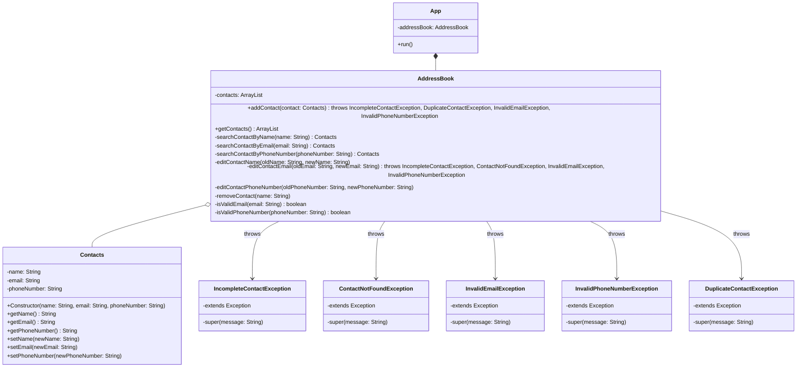

```mermaid
classDiagram
  class App {
   -addressBook: AddressBook
   +run()
  }

    class AddressBook {
        -contacts: ArrayList<Contacts>
        +addContact(contact: Contacts) throws IncompleteContactException, DuplicateContactException, InvalidEmailException, InvalidPhoneNumberException
        +getContacts() ArrayList<Contacts>
        -searchContactByName(name: String) Contacts
        -searchContactByEmail(email: String) Contacts
        -searchContactByPhoneNumber(phoneNumber: String) Contacts
        -editContactName(oldName: String, newName: String)
        -editContactEmail(oldEmail: String, newEmail: String) throws IncompleteContactException, ContactNotFoundException, InvalidEmailException, InvalidPhoneNumberException
        -editContactPhoneNumber(oldPhoneNumber: String, newPhoneNumber: String)
        -removeContact(name: String)
        -isValidEmail(email: String) boolean
        -isValidPhoneNumber(phoneNumber: String) boolean
    }

    class Contacts {
        -name: String
        -email: String
        -phoneNumber: String
        +Constructor(name: String, email: String, phoneNumber: String)

        +getName() String
        +getEmail() String
        +getPhoneNumber() String

        +setName(newName: String)
        +setEmail(newEmail: String)
        +setPhoneNumber(newPhoneNumber: String)
    }

  class IncompleteContactException {
      -extends Exception
      -super(message: String)
  }

class ContactNotFoundException {
    -extends Exception
    -super(message: String)
}

    class InvalidEmailException {
        -extends Exception
        -super(message: String)
    }
    
    class InvalidPhoneNumberException {
        -extends Exception
        -super(message: String)
    }
    
    class DuplicateContactException {
        -extends Exception
        -super(message: String)
    }

App *-- AddressBook
AddressBook o-- Contacts
AddressBook --> IncompleteContactException : throws
AddressBook --> ContactNotFoundException : throws
    AddressBook --> InvalidEmailException : throws
    AddressBook --> InvalidPhoneNumberException : throws
    AddressBook --> DuplicateContactException : throws
```