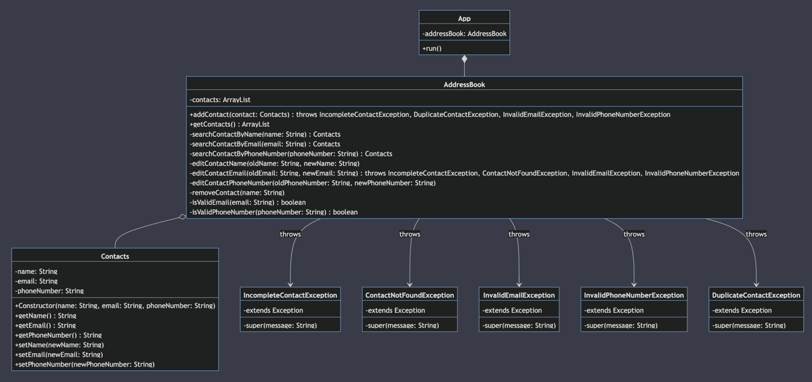
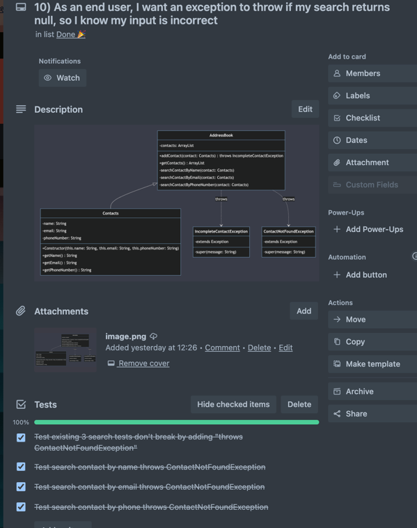
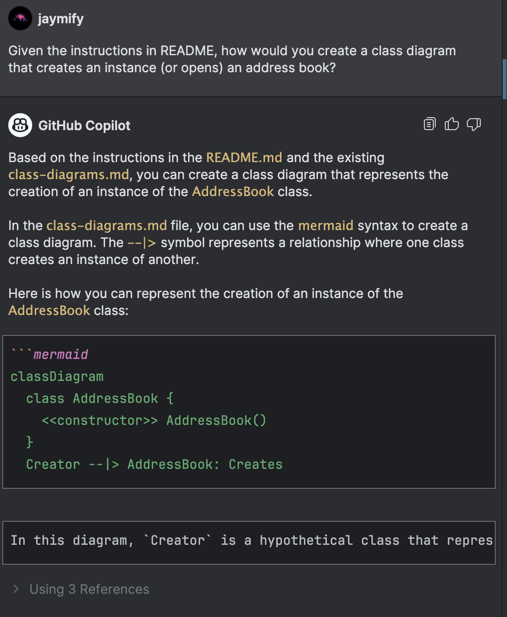

# Domain Models, Class Diagrams and Test Plan

Table of Contents
=================
* [User Stories](#user-stories)
* [Class Diagram](#class-diagram)
* [Use of Agile Development](#use-of-agile-development)
* [Generative AI use](#generative-ai-use)

### User Stories:
1) As an end user, I want to create an instance of the address book, so I can open it.
2)  As an end user, I want to add a new contacts name to the address book, so that I can view their details.
3) As an end user, I want to add a new contacts email to the address book, so that I can view their details.
4) As an end user, I want to add a new contacts phone number to the address book, so that I can view their details.
5) As an end user, I want an exception to throw if I haven't populated all 3 attributes (name, phone, email), so that my contact is complete.
6) As an end user, I want an option to view all contacts in the address book, so that I can get an overview.
7) As an end user, I want to search through my contacts by name, so that I can view their details.
8) As an end user, I want to search through my contacts by email address, so that I can view their details.
9) As an end user, I want to search through my contacts by phone number, so that I can view their details.
10) As an end user, I want an exception to throw if my search returns null, so I know my input is incorrect.
11) As an end user, I want to edit existing contact details, so that the information stays relevant.
12) As an end user, I want to remove an existing contact from the address book, so that I can no longer view their details.
13) As an end user, I want to be unable to add a duplicate email, so that my book remains organised.
14) As an end user, I want to be unable to add a duplicate phone number, so that my book remains organised.
15) As an end user, I want to have the new/edited email validated, so that the address book is uniform.
16) As an end user, I want to have the new/edited phone number validated, so that the address book is uniform.
17) As an end user, I want to use a console interface to interact with the address book, so I have more input.

### Class Diagram:
The completed class diagram shows: 
* The relationships between classes
* Data types of each attribute
* Access modifiers of each attribute and method 
* Return types of each method

### Use of Agile Development:
Link to Trello Board: https://trello.com/invite/b/UseUL9mC/ATTIe883d222fed89658fe59d641fe9beec9C8222052/challenge-3-address-book

### Generative AI use:
I have used Github Copilot to provide potential suggestions to refactor my existing code.
